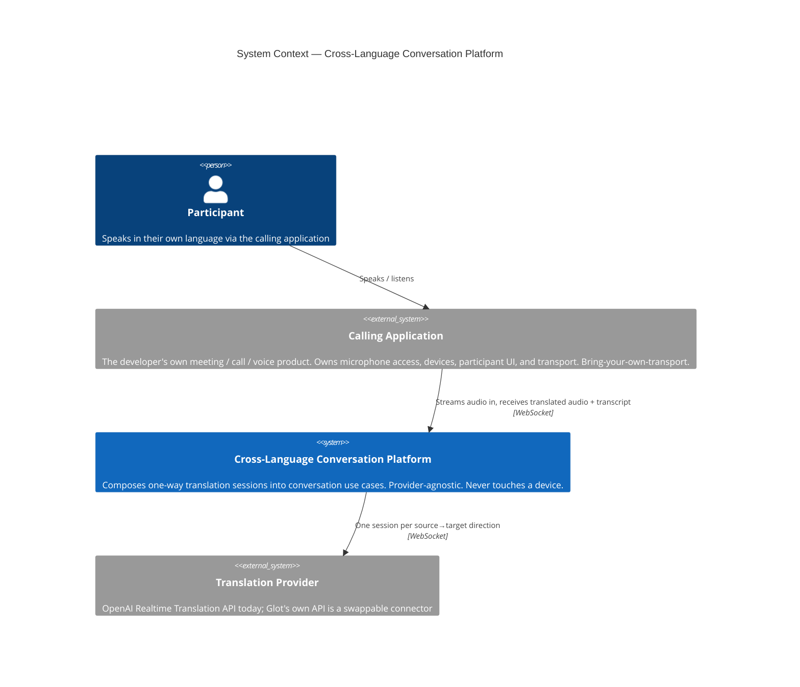
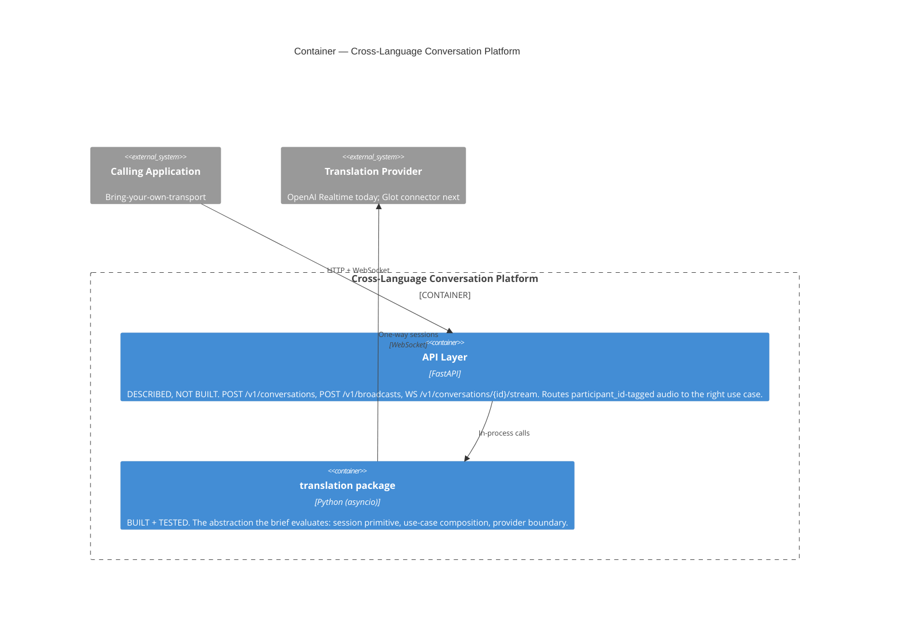
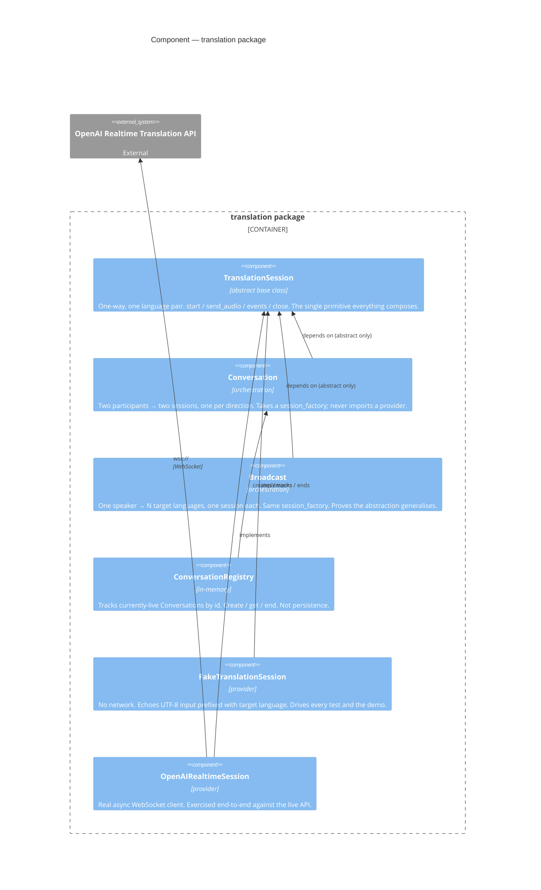

# C4 Diagrams — Cross-Language Conversation Platform

Three levels, each answering a different question. Rendered natively
by GitHub; source is plain Mermaid, editable as text.

## Level 1 — System Context

*What sits around this platform, and where does the boundary fall?*

## Level 2 — Container

*What is actually built, and what is described but deliberately not built?*

## Level 3 — Component (`translation` package)

*Module boundaries and provider-agnosticism, made visible. The arrows
are the argument: `Conversation` and `Broadcast` point only at the
abstract interface, never at a concrete provider.*

## Reading the component diagram

The provider boundary is the whole point. Both use cases (`Conversation`,
`Broadcast`) have exactly one dependency arrow, and it lands on the
abstract `TranslationSession` — not on `FakeTranslationSession`, not on
`OpenAIRealtimeSession`. Swapping providers means passing a different
factory; no orchestration code changes. A third provider
(`GlotSession`) would appear as one more box on the right, with one
more "implements" arrow, and nothing else in the diagram would move.
